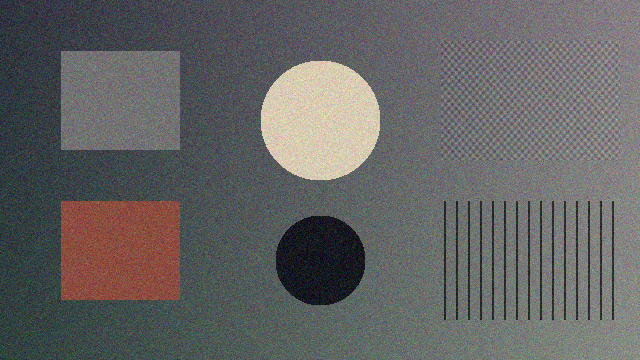
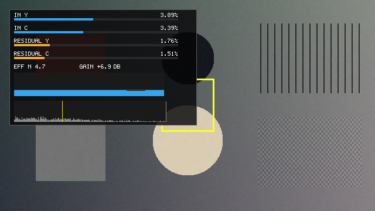
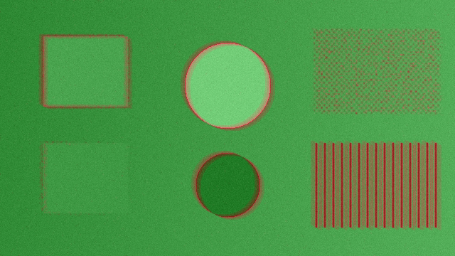

# OpenNR — free noise reduction for DaVinci Resolve

**OpenNR Denoise** is a free, open-source (MIT) OpenFX plugin that brings serious
spatio-temporal video noise reduction to the **free version of DaVinci Resolve** —
the tool free-version users are missing most, since Resolve's built-in Noise
Reduction palette is Studio-only.

It runs on the **Color page** (OpenFX panel), the **Edit page** (Effects Library),
and the **Fusion page**, is fully GPU-accelerated (Metal / CUDA / OpenCL), and is
built around something even the Studio NR tool doesn't offer: **transparency**.
It measures your footage's noise automatically and *shows you* everything — the
measured levels, what's being removed, and where each stage is working.

| Noisy input | OpenNR output (default settings) |
|---|---|
|  |  |

*Validation scene, 5% Gaussian noise: 26.0 dB → 39.0 dB PSNR at defaults. Hard
edges, fine checker texture and 2-px lines survive.*

| Noise Analysis view (live measurements) | Temporal Activity view (green = averaging) |
|---|---|
|  |  |

---

## Features

- **Auto Setup — one button sets up the whole plugin (v3).** It analyzes
  several frames spread across your clip (noise level, chroma character,
  spatial correlation, camera motion) and writes the best settings **into the
  visible sliders** — you immediately see what it chose and dial anything in
  or back from there. Not a mode: afterwards everything is ordinary manual
  state. One Cmd+Z (or the Revert button) restores everything, a read-only
  Analysis line reports what it measured, and your Step 4 look choices are
  never touched.
- **Automatic noise profiling, done right for video** — three estimators run per
  frame: frame-to-frame differences (immune to the spatially-correlated noise
  that compression and debayering create), plus fine- and coarse-scale spatial
  estimators. Robust medians/quantiles keep motion, edges and texture out of
  the measurement. **v3 adds Lock Profile**: freeze the measured profile
  (aggregated across the clip) so every frame filters against the same
  numbers — the HUD shows LOCKED, and it survives save/reload.
- **Motion-tracked temporal NR (v3)** — before gating each neighbour frame the
  temporal stage tries shifting its patch up to ±2 px and matches on the best
  alignment, so slow pans and handheld drift keep their across-frames
  averaging. The hard-knee gate is unchanged — still exactly zero past the
  knee, still ghost-proof — and shifted matches face a steeper gate.
- **Firefly removal (v3)** — single-frame impulses (hot pixels, sensor
  fireflies) are clipped to the 3-frame temporal median. Three independent
  tests must agree before a pixel is touched, so thin fast-moving detail
  survives.
- **Noise EQ (v3)** — the spatial stage split into three bands with their own
  strengths: Fine (pixel-scale NLM), Medium (3–8 px compression clumps) and
  Coarse Luma (16–32 px stains), each removing its own scale only.
- **Deband + noise matte (v3)** — gradient-aware debanding that never touches
  real edges, and a **Matte: Noisiness** view that writes the noise-dominance
  map to RGB + alpha for keying downstream.
- **See everything** — the **Noise Analysis** view renders live measurements
  into the viewer (spatial + temporal noise levels for luma and chroma, meter
  bars, the noise histogram with its median marked); **Noise Only** shows
  exactly what is being removed; **Temporal Activity** paints where
  frame-averaging works (green) vs. where motion protection kicked in (red);
  **Split** gives instant before/after. Resolve's own NR is a black box — this
  one shows its work.
- **Step-by-step controls** — numbered sections (1 · Measure, 2 · Temporal,
  3 · Spatial, 4 · Inspect) with per-stage **Enable toggles** so you can watch
  each stage's contribution, and long-form tooltips on every control.
- **Temporal NR** — motion-adaptive averaging over 3 or 5 frames, gated
  against the measured noise floor. No ghosting: moving pixels fall back to
  spatial filtering automatically.
- **Spatial NR** — noise-adaptive non-local means (or faster bilateral),
  separate **luma / chroma strengths**, edge-aware **Preserve Detail**.
- **Profile from a region** — restrict measurement to a rectangle you place on
  a flat area (positioned live in the Noise Analysis view), or go full manual.
- Works in **DaVinci Resolve free and Studio** (17+), macOS binaries are
  universal (Apple Silicon + Intel, macOS 11+).

## Performance

Measured on an Apple M1 Max (`test/bench_metal.mm`), v3.0. The v3 bench feeds
realistic frames (scene + per-frame noise) rather than v2.1's identical
buffers, so numbers are not comparable to older tables. Motion Tracking (on
by default) costs ~13% at defaults and can be toggled off.

| Resolution | Better (NLM, R3, 5 frames) | Better, panning footage | Faster (bilateral, R2, 3 frames) |
|---|---|---|---|
| HD 1920×1080 | 8.5 ms/frame (118 fps) | 8.3 ms/frame (121 fps) | 4.7 ms/frame (214 fps) |
| UHD 3840×2160 | 33.3 ms/frame (30 fps) | 32.7 ms/frame (31 fps) | 18.0 ms/frame (55 fps) |

Real-time UHD at maximum quality on Apple Silicon.

---

## Install

### macOS
1. Download `OpenNR-3.0.0-macOS.pkg` and double-click it.
   *(The package is not yet notarized: if macOS blocks it, right-click → Open,
   or approve it under System Settings → Privacy & Security → "Open Anyway".)*
2. Restart DaVinci Resolve. If you had a previous OpenNR version, also delete
   Resolve's plugin scan cache so it rescans:
   `rm ~/Library/Application\ Support/Blackmagic\ Design/DaVinci\ Resolve/OFXPluginCacheV2.xml`

Alternative (no installer): unzip `OpenNR-3.0.0-macOS.zip` and double-click
`Install OpenNR (macOS).command`, or copy `OpenNR.ofx.bundle` into
`/Library/OFX/Plugins/` yourself. If you copy a bundle that was downloaded or
AirDropped, clear the quarantine flag or macOS will silently refuse to load it:
`sudo xattr -dr com.apple.quarantine /Library/OFX/Plugins/OpenNR.ofx.bundle`

### Windows
Download `OpenNR-x.y.z-Windows.zip` from the latest release, unzip, and either
double-click `Install OpenNR (Windows).bat` or drag `OpenNR.ofx.bundle` into
`C:\Program Files\Common Files\OFX\Plugins` yourself. Restart Resolve.
(The Windows build renders through OpenCL — works on NVIDIA, AMD and Intel
GPUs. A CUDA-native path exists in the tree, gated until verified on hardware.)

### Linux
Copy `OpenNR.ofx.bundle` into `/usr/OFX/Plugins/`.

### Where it appears in Resolve
- **Color page** → Effects → **OpenFX** → Filters → *OpenNR* → **OpenNR Denoise** — drag onto a node
- **Edit page** → Effects Library → **OpenFX** → Filters → *OpenNR* — drag onto a clip
- **Fusion page** → Effects Library → **OpenFX** → *OpenNR* — add as a tool

---

## Quick start (the four steps)

1. Drop **OpenNR Denoise** on a node (Color page) or clip (Edit page). The
   defaults are calibrated from the automatic noise measurement — most footage
   is already improved at this point. Adjust **Strength** to taste.
2. **Check the measurement**: Step 4 → View → **Noise Analysis**. You'll see
   the measured spatial/temporal noise for luma and chroma on screen. If the
   numbers look implausibly low for obviously noisy footage, raise
   **Auto Profile Adjust** (Step 1) — or place the measurement region on a
   flat area using **Automatic (From Region)**.
3. **Check what's being removed**: View → **Noise Only**. Pure static = good.
   Visible edges/faces = too aggressive: lower Strength or raise Preserve
   Detail.
4. Set View back to **Result**. Done.

**Colorists:** apply NR early in the node tree (pre-grade), as with Resolve's
built-in NR — denoise before contrast/saturation expansion amplifies the noise.

**A/B each stage:** the Enable checkboxes in Steps 2 and 3 toggle temporal and
spatial filtering independently — flip them while watching the viewer (or the
Temporal Activity view) to understand what each is contributing.

## The controls

| Step | Control | What it does |
|---|---|---|
| — | **Strength** | Overall amount; scales every strength at once. 0 = off, 1 = normal, 2 = double. |
| — | **Auto Setup (Analyze Footage)** | Analyzes the clip and writes the best settings into the sliders below, then locks the profile. Everything stays manually adjustable; one undo reverts. |
| — | Analysis | Read-only report of what the last Auto Setup measured and decided. |
| — | Revert Auto Setup | Restores every denoise control to its pre-Auto-Setup value. |
| 1 | **Noise Profile** | Automatic (whole frame) / Automatic (from region) / Manual. |
| 1 | Region Center X/Y, Size | The measurement rectangle (visible in Noise Analysis view). Put it on a flat area. |
| 1 | **Auto Profile Adjust** | Scales the automatic measurement (×0.25–×4). The escape hatch when the estimate reads low/high. |
| 1 | Manual Luma / Chroma Noise (%) | Direct noise levels, used only in Manual mode. Clean ≈ 0.5–1, noisy ≈ 2–5, low-light ≈ 5–10. |
| 1 | **Lock Profile** | Measures across the clip and freezes the profile so every frame filters against the same numbers. HUD shows LOCKED; saved with the project. |
| 2 | **Enable Temporal NR** | Toggle the across-frames stage. |
| 2 | Number of Frames | 3 or 5 frames averaged. |
| 2 | **Motion Tracking** | Shift-search patch matching (±2 px) so slow pans keep their temporal averaging. On by default; off = v2.1 behavior and a small speed gain. |
| 2 | Luma / Chroma Strength | Per-channel-type temporal blending. |
| 2 | Motion Threshold | How much change counts as motion. Lower if you see ghosting. |
| 2 | **Firefly Removal** | Clips single-frame impulses (hot pixels) to the temporal median. Turn off only if real one-frame flashes lose their sparkle. |
| 3 | **Enable Spatial NR** | Toggle the within-frame stage. |
| 3 | Method | Better (NLM, patch-based) or Faster (bilateral). |
| 3 | Search Radius | How far to look for similar patches (1–8 px). |
| 3 | Luma / Chroma Strength | Per-channel-type spatial filtering. Chroma tolerates high values. |
| 3 | Preserve Detail | Edge-aware protection of real structure. |
| 3 | Chroma Blotch Reduction | Large-radius chroma pass for the big soft 4:2:0 color stains. |
| 3 | **Noise EQ · Fine / Medium / Coarse** | Per-band strengths: pixel-scale grain / 3–8 px clumps / 16–32 px luma stains. Fine 100 = classic behavior; Medium and Coarse are off until you (or Auto Setup) need them. |
| 4 | Shadow Desaturate, Desat Range | Saturation-vs-luma curve to hide chroma noise in shadows. |
| 4 | Luma Texture | Re-injects original brightness texture after denoising. |
| 4 | **Deband** | Gradient-aware banding smoother + micro-dither. Edges are never touched. |
| 4 | Film Grain, Grain Size, Grain Color | Clean synthesized grain to finish. |
| 5 | **View** | Result / Split / Input / After Temporal / Noise Removed / Noise Analysis / Temporal Activity / SNR Map / **Matte: Noisiness** (map in RGB + alpha, for keying downstream). |

### Coming from Resolve Studio's NR palette?

| Studio NR control | OpenNR equivalent |
|---|---|
| Temporal NR → Frames | Step 2 → Number of Frames |
| Temporal NR → Motion Est. Type | (automatic; difference-based gating) |
| Temporal NR → Motion Range / Threshold | Step 2 → Motion Threshold |
| Temporal Threshold → Luma / Chroma | Step 2 → Luma / Chroma Strength |
| Spatial NR → Mode (Faster/Better) | Step 3 → Method |
| Spatial NR → Radius | Step 3 → Search Radius |
| Spatial Threshold → Luma / Chroma | Step 3 → Luma / Chroma Strength |
| Blend | Strength (inverted sense) |
| — | Step 1 (noise measurement) and Step 4 (analysis views) — no Studio equivalent |

## Honest limitations

- **No motion-compensated temporal NR.** Studio's temporal NR tracks motion
  vectors and averages along motion paths; OpenNR detects motion and protects
  it instead (spatial NR takes over there). Comparable on locked-off/slow
  shots; Studio keeps an edge on fast pans.
- **No AI model.** Studio 20+ adds UltraNR; OpenNR is classical (NLM) — very
  competitive at normal noise levels, less magical on extreme starlight
  footage.
- Requires float RGBA processing (all Resolve versions provide this).

## Building from source

macOS (Xcode command line tools):

```sh
cd plugin && make            # universal arm64 + x86_64, macOS 11+
sudo make install            # copies to /Library/OFX/Plugins
```

Linux (CUDA toolkit + OpenCL headers):

```sh
cd plugin && make && sudo cp -r OpenNR.ofx.bundle /usr/OFX/Plugins/
```

Windows: build the four sources (`OpenNRPlugin.cpp`, `CudaKernel.cu`,
`OpenCLKernel.cpp`, OFX Support lib) into `OpenNR.ofx` with MSVC + nvcc,
mirroring Blackmagic's OpenFX samples. Prebuilt Windows/Linux binaries via CI
are on the roadmap.

Release packaging (macOS): `./build_release.sh` produces the `.pkg` and `.zip`
(sets the deployment target, ad-hoc signs, and sanity-checks the minimum-OS
stamp).

## Tests

The algorithm is validated outside Resolve; run these before any release:

- `test/test_denoise.cpp` — synthetic scenes with known injected noise:
  estimator accuracy on iid **and spatially-correlated** noise (the real-world
  camera/compression case), motion robustness, PSNR gates (+13 dB static /
  +9 dB motion / +11 dB correlated at σ=0.05), identity at Strength 0 and with
  both stages disabled, duplicate-frame guard, region profiling, and renders
  of every view mode (including the HUD) for visual inspection.
- `test/test_metal.mm` — GPU parity: the real Metal pipeline vs. the CPU
  reference across 12 configurations (agreement ~2×10⁻⁵).
- `test/bench_metal.mm` — the performance numbers above.

```sh
cd test
c++ -O2 -std=c++14 -I../plugin test_denoise.cpp -o test_denoise && ./test_denoise
c++ -O2 -std=c++14 -I../plugin test_metal.mm ../plugin/MetalKernel.mm \
    -framework Metal -framework Foundation -o test_metal && ./test_metal
```

## How it works (short version)

1. **Measure** — three per-frame estimators: median |frame difference|
   (measures the *true* total noise, immune to the spatial correlation that
   debayer/compression create; motion-robust via a low-quantile cross-check
   and a spatial-estimate clamp), median |Laplacian| at fine scale, and at
   coarse scale (catches blotchy correlated noise). The temporal stage is
   gated by the temporal estimate; the spatial stage by the spatial one.
2. **Temporal** — each pixel is compared patch-wise (3×3) against ±1/±2
   frames; differences are bias-corrected by the expected noise difference
   and gated softly in units of σ. The achieved effective sample count is
   carried forward per pixel (and visualized in Temporal Activity).
3. **Spatial** — non-local means on the temporal result, filter strength tied
   to the *remaining* noise (σ/√effN), patch distances bias-corrected by 2σ²,
   luma-guided chroma weights, edge-aware strength reduction.
4. **Inspect** — the analysis views are rendered by the same GPU kernels,
   straight from the measurement buffers (histograms included), so what you
   see is exactly what the filters use.

## License

MIT — free for any use, including commercial. See [LICENSE](LICENSE).
The vendored OpenFX headers/support library are BSD-licensed by the Open
Effects Association.
